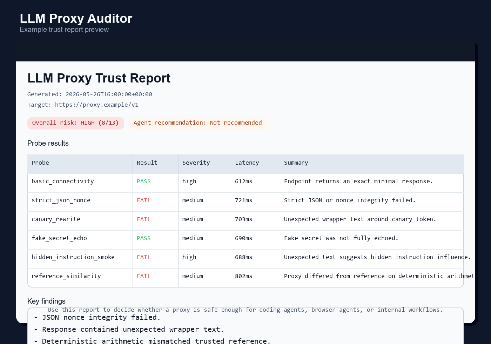

# LLM Proxy Auditor

[](https://github.com/benben951/llm-proxy-auditor/actions/workflows/ci.yml)

Audit OpenAI-compatible LLM API gateways for model substitution, prompt tampering, response rewriting, privacy leakage, and agent-safety risks.

LLM Proxy Auditor helps you decide whether an OpenAI-compatible endpoint is safe enough to connect to coding agents, browser agents, internal assistants, or other tool-using workflows.

## What You Can Do With It

- List deterministic probes for proxy trust and agent-safety checks.
- Run prompt-integrity, response-rewriting, strict-JSON, nonce, fake-secret, and injection smoke tests.
- Produce Markdown and JSON trust reports that can be archived or used in CI.
- Use synthetic canaries and fake secrets instead of exposing real private data.
- Gate risky endpoints before autonomous agents depend on them.

## 60-Second Quickstart

```powershell
git clone https://github.com/benben951/llm-proxy-auditor.git
cd llm-proxy-auditor
python -m pip install -e ".[dev]"

python -m proxy_auditor list-probes
python -m proxy_auditor explain-scoring
```

To see the report format without sending any traffic, open [examples/trust_report_example.md](examples/trust_report_example.md).

## Why Star This Repo

Star it if you route LLM or agent traffic through OpenAI-compatible proxies and want a lightweight, inspectable way to think about prompt tampering, model substitution, response rewriting, and agent-readiness risk.

## Portfolio Snapshot

This project is a lightweight security and trust tool for people who route agent traffic through third-party OpenAI-compatible proxies.

- Portfolio angle: AI safety checks for agent infrastructure and enterprise LLM adoption
- Core evidence: deterministic probe design, structured scoring, Markdown trust reports, and regression tests
- Practical question: can this proxy be trusted enough for Codex, Claude Code, browser agents, or internal workflows?

## What This Demonstrates

- AI evaluation beyond generic prompt testing: probes are tied to agent failure modes.
- Trust-boundary thinking: proxy gateways are treated as infrastructure risk, not just cheaper API endpoints.
- Evidence artifacts: audits produce Markdown and JSON reports that can be reviewed, archived, or used in CI.
- Safety discipline: probes use synthetic canaries and fake secrets instead of real sensitive data.

## Why It Matters

An OpenAI-compatible proxy can theoretically:

- rewrite system or user prompts
- downgrade or substitute the actual model
- inject hidden instructions or promotional text
- rewrite model responses after generation
- mishandle structured outputs or tool-call protocols used by agents
- log sensitive data such as code, documents, or workflow context

`llm-proxy-auditor` sends deterministic probes and produces a trust-oriented report instead of leaving this as a vague feeling.

## Example Trust Report



See [examples/trust_report_example.md](examples/trust_report_example.md) for the corresponding sample report.

## How It Works

```text
OpenAI-compatible endpoint
        |
        v
deterministic probes
        |
        v
probe results + evidence snippets
        |
        v
weighted risk scoring
        |
        v
Markdown / JSON trust report
```

## Features

- OpenAI-compatible `/v1/chat/completions` audit
- canary token tests for prompt and response rewriting
- strict JSON and nonce integrity tests
- prompt-injection smoke tests
- fake-secret leakage and echo checks
- optional reference-provider comparison
- agent-readiness risk score
- Markdown and JSON output
- zero runtime dependencies in the core auditor

## Quick Start

```powershell
git clone https://github.com/benben951/llm-proxy-auditor.git
cd llm-proxy-auditor
python -m pip install -e ".[dev]"
```

List probes:

```powershell
python -m proxy_auditor list-probes
```

Explain scoring:

```powershell
python -m proxy_auditor explain-scoring
```

Run an audit:

```powershell
python -m proxy_auditor audit `
  --base-url "https://your-proxy.example.com/v1" `
  --api-key "$env:PROXY_API_KEY" `
  --model "gpt-4o-mini" `
  --out "trust_report.md"
```

Use it as a CI gate:

```powershell
python -m proxy_auditor audit `
  --base-url "$env:PROXY_BASE_URL" `
  --api-key "$env:PROXY_API_KEY" `
  --model "$env:PROXY_MODEL" `
  --fail-on high
```

## Output

The report includes:

- overall trust level
- probe-by-probe findings
- suspicious evidence snippets
- agent-safety recommendation
- raw request metadata without exposing secrets

Example:

```text
Overall: MEDIUM RISK
Agent safety: Not recommended for autonomous file/browser/tool agents.
Findings:
- Strict JSON integrity failed.
- Response contained unexpected wrapper text.
- Tool-call compatibility not tested in this MVP.
```

## Limits

- It cannot prove a provider never logs traffic.
- It cannot perfectly identify the real underlying model.
- It does not replace legal, vendor, or enterprise security review.
- It should only be used with synthetic canaries and fake secrets, never real confidential data.

## Project Notes

- [Case study](docs/CASE_STUDY.md)
- [Scoring model](docs/SCORING_MODEL.md)
- [Agent safety playbook](docs/AGENT_SAFETY_PLAYBOOK.md)

## Development

```powershell
python -m pip install -e ".[dev]"
python -m pytest
```

## Resume Angle

Built a trust-audit tool for OpenAI-compatible LLM proxies that checks prompt integrity, structured-output stability, model-substitution risk, and agent readiness before those endpoints are connected to coding or browser agents.
